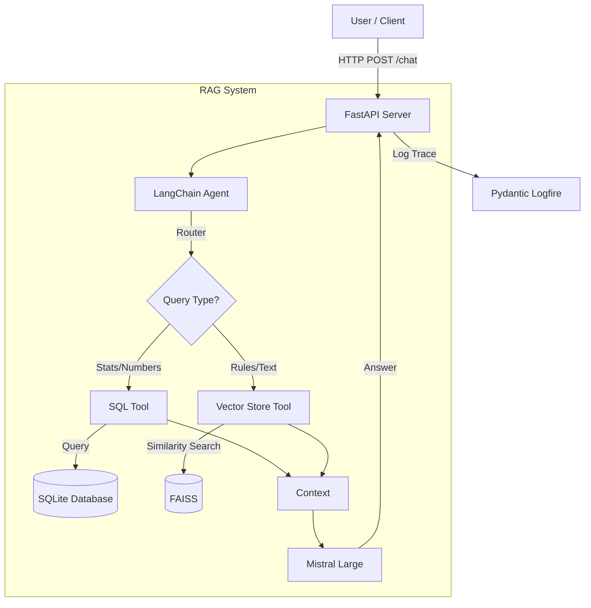

# SportSee RAG System

## 1. Introduction
This project implements a **Hybrid Retrieval-Augmented Generation (RAG)** system for SportSee, designed to answer natural language questions about basketball players and rules. It combines:
- **Unstructured Data Retrieval**: Vector search for textual rules and regulations (Reddit discussions, Rulebooks).
- **Structured Data Retrieval**: SQL queries for statistical data (e.g., "Who has the highest PPG?").

The system is powered by **Mistral AI** (`mistral-large-latest` + `mistral-embed`) and is exposed via a **FastAPI** interface with monitoring via **Logfire**.

## 2. Architecture

### Architecture Diagram


## 3. Project Structure
```text
sportsee-rag/
├── data/                 # Data storage
│   ├── raw/              # Raw Excel stats
│   ├── sportsee.db       # SQLite database
│   └── vector_db/        # FAISS Index
├── inputs/               # PDF/Markdown Source Archives
├── src/                  # Source code
│   ├── api/              # API endpoints
│   ├── core/             # Config & Logging
│   ├── rag/              # Chains, Agents, Vector Store
│   └── utils/            # Docling/Markdown converters
├── ingest_text_archives.py # Script to ingest PDFs/MD to Vector Store
├── load_excel_to_db.py   # Script to ingest Excel to SQL
├── evaluate_ragas.py     # Evaluation script
├── Dockerfile            # Container config
└── pyproject.toml        # Dependencies
```

## 4. Installation and Setup

### Prerequisites
- Python 3.10+
- Poetry (recommended) or pip

### Steps
1. **Clone and Install**
   ```bash
   git clone https://github.com/YOUR_USERNAME/sportsee-rag.git
   cd sportsee-rag
   poetry install
   ```

2. **Environment Variables**
   Create a `.env` file:
   ```bash
   MISTRAL_API_KEY=your_mistral_key_here
   # LOGFIRE_TOKEN=your_token (optional)
   DATABASE_URL=sqlite:///./data/sportsee.db
   ```

3. **Data Ingestion (Hybrid)**
   Run the following scripts to populate the system:
   ```bash
   # 1. Ingest Text Archives (Vector Store)
   poetry run python ingest_text_archives.py
   
   # 2. Ingest Excel Stats (SQL DB)
   poetry run python load_excel_to_db.py
   ```

4. **Run Server**
   ```bash
   poetry run uvicorn src.api.main:app --reload
   ```
   Access API at `http://localhost:8000/docs`.

## 5. Evaluation (Ragas)
To assess the performance (Faithfulness, Relevancy), run:
```bash
poetry run python evaluate_ragas.py
```
Results will be saved to `evaluation_results.csv`.

## 6. Docker Utilization
```bash
docker build -t sportsee-rag .
docker run -p 8000:8000 --env-file .env sportsee-rag
```
