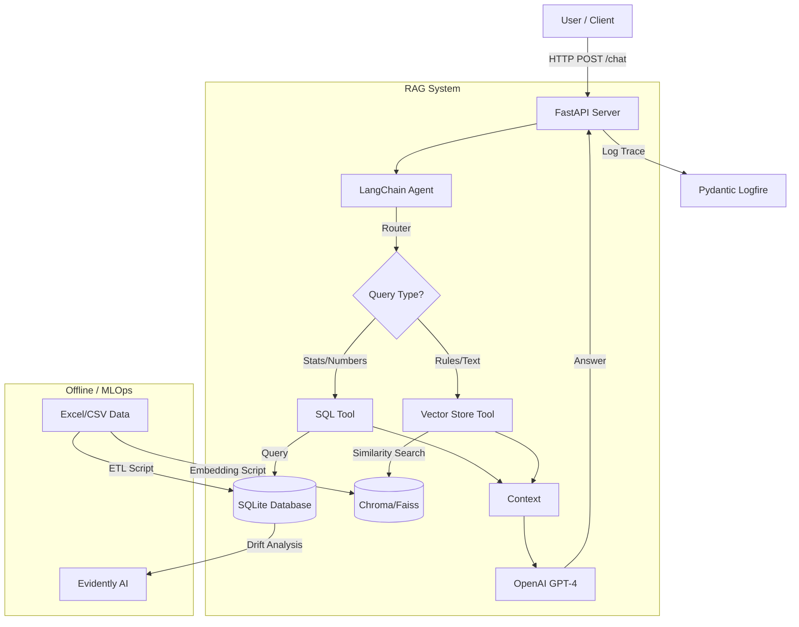

# SportSee RAG System

## 1. Introduction
This project implements a Hybrid Retrieval-Augmented Generation (RAG) system for SportSee, designed to answer natural language questions about basketball players and rules. It combines:
- **Structured Data Retrieval**: SQL queries for statistical data (e.g., "Who has the highest PPG?").
- **Unstructured Data Retrieval**: Vector search for textual rules and regulations.

The system is exposed via a REST API and includes monitoring and evaluation pipelines.

## 2. Architecture
The system follows a microservices-ready architecture using Docker.

### Architecture Diagram



### Components
- **FastAPI**: Serves the REST API.
- **LangChain**: Orchestrates the RAG logic and tool selection.
- **SQLite**: Stores structured player statistics.
- **Vector Store**: Stores embeddings of rulebooks and textual documents.
- **OpenAI GPT**: Generates the final natural language response.
- **Pydantic Logfire**: Provides real-time observability and tracing.
- **Evidently AI**: Monitors data drift and data quality.

## 3. Project Structure
The repository is organized to separate source code, data, and configuration.

```text
sportsee-rag/
├── .github/              # CI/CD workflows (GitHub Actions)
├── data/                 # Data storage
│   ├── raw/              # Raw input files (Excel, CSV)
│   └── sportsee.db       # SQLite database
├── src/                  # Source code
│   ├── api/              # API endpoints and server logic
│   ├── core/             # Configuration and logging
│   ├── data/             # Data loading and schemas
│   ├── monitoring/       # Drift detection scripts
│   └── rag/              # RAG logic (chains, tools, vector store)
├── tests/                # Automated tests
├── build_vector_db.py    # Script to initialize the vector database
├── evaluate_ragas.py     # Script to run Ragas evaluation
├── Dockerfile            # Docker configuration
├── pyproject.toml        # Python dependencies (Poetry)
└── README.md             # Project documentation
```

## 4. Installation and Setup

### Prerequisites
- Python 3.10 or higher
- Docker (optional, for containerized run)
- OpenAI API Key

### Local Installation
1.  **Clone the repository**:
    ```bash
    git clone https://github.com/YOUR_USERNAME/sportsee-rag.git
    cd sportsee-rag
    ```

2.  **Install dependencies using Poetry**:
    ```bash
    pip install poetry
    poetry install
    ```

3.  **Configure Environment Variables**:
    Copy the example environment file and edit it with your keys.
    ```bash
    cp .env.example .env
    # Open .env and set OPENAI_API_KEY=sk-...
    ```

4.  **Initialize Databases**:
    ```bash
    # Build the vector database from input documents
    poetry run python build_vector_db.py
    ```

## 5. Usage (API Documentation)

### Starting the Server
Run the API locally:
```bash
poetry run uvicorn src.api.main:app --reload
```
The server will start at `http://localhost:8000`.

### API Endpoints

#### 1. Chat Endpoint
-   **URL**: `/chat`
-   **Method**: `POST`
-   **Description**: Submits a natural language query to the RAG system.

**Request Body (JSON):**
```json
{
  "query": "Who has the highest 3-point percentage?"
}
```

**Response Body (JSON):**
```json
{
  "answer": "Steph Curry has the highest 3-point percentage with 43.4%.",
  "processing_time": 1.25
}
```

**Example cURL Call:**
```bash
curl -X POST "http://localhost:8000/chat" \
     -H "Content-Type: application/json" \
     -d '{"query": "What is a 3-second violation?"}'
```

#### 2. Health Check
-   **URL**: `/health`
-   **Method**: `GET`
-   **Description**: Checks if the API is running.

#### 3. Documentation (Swagger UI)
-   **URL**: `/docs`
-   **Description**: Interactive API documentation generated automatically by FastAPI.

## 6. Evaluation
To assess the performance of the RAG system, we use the **Ragas** framework.

Run the evaluation script:
```bash
poetry run python evaluate_ragas.py
```
This script will:
1.  Run a set of test questions through the RAG pipeline.
2.  Compare the answers against a ground truth dataset.
3.  Calculate metrics: Faithfulness, Answer Relevancy, and Context Precision.
4.  Output the scores to the console.

## 7. Deployment
The application is containerized for easy deployment.

### Building the Docker Image
```bash
docker build -t sportsee-rag .
```

### Running the Container
```bash
docker run -p 8000:8000 --env-file .env sportsee-rag
```

### CI/CD Pipeline
A GitHub Actions workflow is set up in `.github/workflows/main.yml`. It automatically:
1.  Installs dependencies.
2.  Runs unit tests (`pytest`).
3.  Builds the Docker image (on push to `main`).
